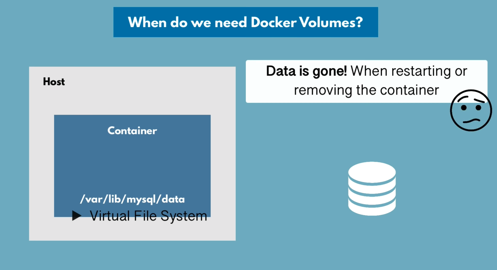

# Docker Basics

## Important commands

- Syntax example:

  - `docker run -d -p 6000:6379 —name <container name> <container image>:<version>`

- Pull container:

  - `docker pull <image tag of container>`

- Create new container from image. If image cannot be found locally it will pull first:

  - `docker run <image tag of container>`

- Start in detached mode:

  - `docker run -d <image tag of container>`

- Starts and binds the container to localhost port 6000 and default port 6379 of the container. When running multiple containers the localhost port must be different, container port can be the same:

  - `docker run -p 6000:6379 <image tag of container>`

- Start already created and stopped container:

  - `docker start <id of container or name>`

- Stop container with id:

  - `docker stop <id of container>`

- Shows all containers running or not running:

  - `docker ps`

- Delete a container:

  - `docker rm <id of container>`

- Delete a docker image:
  `docker rmi <id of image>`

- Shows images on your local machine:

  - `docker images`

- Show logs for debugging:

  - `docker logs <container id>` or `docker logs <container name>`

- Show only last of logs:

  - `docker logs <container id> | tail`

- Strings the logs. Let’s you draw a line —— in terminal to mark the last logs, only new logs are shown after that line:

  - `docker logs <container id> -f`

- Specifies a custom name for container:

  - `—name <name of container>`

- Executes integrated terminal in directory /bin/bash of container. Let’s you browse the files, configs and directories of the container.
  Note: Some containers don't have a bin/bash directory. Alternative can be /bin/sh. One of those two always works:

  - `docker exec -it <container id or name> /bin/bash`

- Inside the integrated terminal we can run following commands:

  - `env` - print environment variables
  - `exit` - exits -it terminal

- Show all docker networks:

  - `docker network ls`

- Create new docker network:

  - `docker network create <network-name>`

- Set environment variable on docker run:

  - `docker -e <environment variable>`

- Connect container to docker network:

  - `docker —net <network name>`

- Build a docker file:
  - `docker build -t <own image name>:<version of own image> <location of docker file>`
    Example: `docker build -t my-app:1.0 .`

### Example:

In this example we set up a mongoDB container and a mongo-express framework (UI tool for mongoDB) to work in the same network.
The backslash is for writing on new lines in the terminal.

```
Docker run -d \
-p 2701:2701 \
-e MONGO_INITDB_ROOT_USERNAME=admin \
-e MONGO_INITDB_ROOT_PASSWORD=password \
--name mongoDB \
—net mogno-network \
mongo
```

```
Docker run -d \
-p 8081:8081 \
-e ME_CONFIG_MONGODB_ADMINUSERNAME=admin \
-e ME_CONFIG_MONGODB_ADMINPASSWORD=password \
-e ME_CONFIG_MONGODB_SERVER=mongoDB \
--name mongo-express \
—net mogno-network \
mongo-express
```

## Docker compose

Docker compose is a a tool that helps to abstract the above procedure of having to run two or more containers with the above command lines. It is comparable to a package.json file that stores our configuration for the run commands of containers. It is important to note that the -net command for telling a container to run in a certain network can be omitted as docker compose will automatically create a shared network for us.
A docker compose file can be saved in the .yaml format. In a .yaml file indentation is very important.

```yaml
version: "3"
services:
  mongodb:
    image: mongo
    ports:
      - 27017:27017
    environment:
      - MONGO_INITDB_ROOT_USERNAME=admin
      - MONGO_INITDB_ROOT_PASSWORD=password
  mongo-express:
    image: mongo-express
    ports:
      - 8080:8081
    environment:
      - ME_CONFIG_MONGODB_ADMINUSERNAME=admin
      - ME_CONFIG_MONGODB_ADMINPASSWORD=password
      - ME_CONFIG_MONGODB_SERVER=mongoDB
```

#### Starting containers

In order to run a docker compose configuration we need to run following command.
(-f looks for the .yaml file)
(up runs the containers configured in the .yaml file)

`docker-compose -f <name of .yaml file> up`

The default network name that docker-compose creates for the containers is called "myapp_default".

#### Stopping containers

Instead of needing to stop containers individually by running the docker stop command providing the id or the name, we can stop all the containers configured in the .yaml file with the following command:

`docker-compose -f <name of .yaml file> down`

In addition to stopping the containers, this command will also remove the network that was created running docker-compose.

## Deplyoment

We developed an application feature and we want to deploy it. In order to deploy our application it should be packaged into its own docker container. This means we need to build a docker image from our application.
After we committed our changes to git, a continuous integration (like jenkins) takes care of packaging our application into a docker iamge and pushes it into our docker repository.

#### Docker workflow


#### Docker file

A docker file is a blueprint for building docker images. A docker file NEEDS to be called exactly "Dockerfile".
Important: Whenever we adjust a Dockerfile, we need to rebuild the image.

1. First we base our image on another image. In this example we created an application with node, this is why we base it on a node image.
2. Secondly we can create environment variables, which is optional. Generally it is recommended to define our variables externally inside of a docker-compose file, like we did previously.
3. Inside the run command we can execute any Linux command. In this case we create a folder for our application. Note: This directory will be created INSIDE of the container and NOT on the host.
4. In difference to the run command the copy command will execute on the host machine. It takes the source (. in this example) and the target (/home/app)
5. The CMD command executes a entry point Linux command. With this we start our application. We can do this because we are basing our image on a node base image, which has node pre-installed for us. The difference to RUN is that CMD is an entrypoint command. This means we can have multiple RUN commands but only one CMD command.

```
FROM node:13-alpine

ENV MONGO_DB_USERNAME=admin
    MONGO_DB_PASSWORD=password

RUN mkdir -p /home/app

COPY . /home/app

CMD ["node", "/home/app/server.js"]
```

#### Building a docker file

In order to build a docker file we run the following command.
(-t stands for target, this is how we can name our docker file)
(the second paramter is the location of the docker file)

`docker build -t my-app:1.0 .`

This step is usually taken over by CI tools like Jenkins. Jenkins takes the Dockerfile we create, so we have to commit this file, and it will build a docker image based on the docker file.

#### Separating docker config files and app files

It is genreally recommended to separate the files of our application from those which are required for building the docker image. For that we can access our /home/app file inside of our docker container, opening the filesystem with the `exec -it` command. We navigate to the /home/app directory and move all the files that are necessary for our application into the /app directory.
After that we configure our Dockerfile and change the COPY command to the following:

`COPY ./app /home/app`

After that we need to delete the container and image and rebuild it.

### Private Docker registry

In this example we create a private docker repository in a docker registry. For the docker registry Amazon ECR is used. Alternatives are Nexus and Digital Ocean.
Again, this workflow will be taken over by tools like Jenkins server, if configured.


#### Image naming in registries


1. Login to AWS and select ECR(Elastic Container Registry)
2. Create repository
   (Specific to AWS - 1 repository per image)
   (different tags (versions) of an image are stored in the repository)
3. In order to push images, we need to log in once to the private repository
   `docker login`
   (AWS uses own login command - can be found under "view push commands")
   - AWS CLI must be installed
   - Credentials must be configured
4. Build the image (if not already build)
5. Tag the image (renaming the image to include the repository name)
   `docker tag my-app:1.0 <repository name>`
6. Push the renamed image (don't forget to include the version number (also called tag))
   `docker push <renamed image>:<version number>`

### Deploying to development server


In order to run our application on a development server, we need to include all the containers that make up that appliction environment. For that we include our my-app container into the docker-compose .yaml file.

```yaml
version: "3"
services:
  my-app:
    image: 4732847832974.dkr.ecr.eu-central-1.amazonaws.com/my-app:1.0
    ports:
      - 3000:3000
    // (environment if the variables are not defined inside our Dockerfile)
  mongodb:
    image: mongo
    ports:
      - 27017:27017
    environment:
      - MONGO_INITDB_ROOT_USERNAME=admin
      - MONGO_INITDB_ROOT_PASSWORD=password
  mongo-express:
    image: mongo-express
    ports:
      - 8080:8081
    environment:
      - ME_CONFIG_MONGODB_ADMINUSERNAME=admin
      - ME_CONFIG_MONGODB_ADMINPASSWORD=password
      - ME_CONFIG_MONGODB_SERVER=mongoDB
```

As we try to pull from a privat repository, the development server needs to authenticate beforehand (docker login) in order to be able to access our private repo.
On the development server we create the same .yaml file to be able to start all three containers user docker-compose.
`docker-compose -f <.yaml file> up`

When connecting to the database make sure to rename the URIs in your code from localhost to the container name we configured (in our case monogdb). We can also omit the port as it is also configured in the .yaml file.

## Persisting data with volumes

Docker volumes are used for data persistence in docker (databases or stateful applications).




#### Volume Types

There are three volume types:

1. Host Volumes
2. Anonymous Volumes
3. Named Volumes

The volume type that should be used in production is the named volume type.


#### Configuration in the .yaml file


#### Docker Volumes Location


Important: MacOS creates a Linux virtual machine and stores all the docker data there. This means accessing /var/lib/docker/volumes will return that no direcotry can be found. Instead it can be found when accessing this virtual machine via:

`screen ~/Library/Containers/com.docker.docker/Data/com.docker.driver.amd64-linux/tty`

This will bring us to the terminal of that virtual machine where the docker data can ba accessed via:

`/var/lib/docker/volumes`


In order to kill the screen session (terminal of the Linux virtual machine), we can run:

`ctrl + a + k` and confirm with `y`
